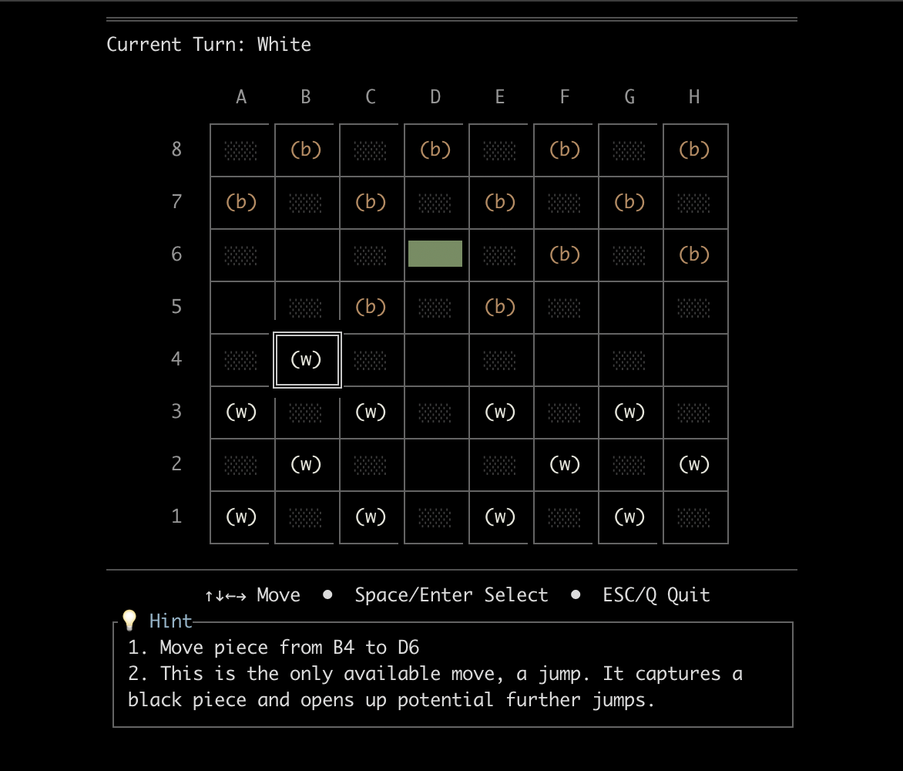

# Terminal Checkers in Rust

> This is a vibe-coding experiment. 
> How ready are modern dev-agents for handling an unpopular language and a relatively complex task?

A terminal-based Checkers game built with Rust.

**Features:**
- Terminal interface using crossterm
- AI opponent powered by Gemini API (when API key is available)
- Two-player hot-seat mode (when no API key is present)
- AI-powered hints for human players (press H during your turn)
- Arrow key navigation with visual feedback
- Full checkers rules including forced captures and king promotion

<div align="center">
  
  <br>
  <em>The game interface showing the board state with an AI hint suggesting the best move (B4 to D6)</em>
</div>

**Getting Started:**

1. **Install Rust:**
   ```bash
   curl --proto '=https' --tlsv1.2 -sSf https://sh.rustup.rs | sh
   ```
   
2. **Clone the repository:**
   ```bash
   git clone https://github.com/anatoly-chichikov/checkers-rs.git
   cd checkers-rs
   ```
   
3. **Run the game:**
   ```bash
   cargo run --release
   ```

**Game Modes:**
- **With Gemini AI:** Human plays as White vs AI as Black (requires API key)
- **With Simple AI:** Human plays as White vs built-in AI as Black (no API key needed)
  - The built-in AI makes valid moves following all checkers rules
  - Prioritizes captures when available
  - Perfect for offline play or testing

**Controls:**
- **Arrow keys:** Navigate the board
- **Space or Enter:** Select/deselect pieces and make moves
- **H:** Get AI hint for the best move (requires API key)
- **Esc or Q:** Exit the game

**Rules:**
- White pieces start at the bottom
- Black pieces start at the top
- Regular pieces can only move diagonally forward
- Kings (marked with brackets) can move in any diagonal direction
- Captures are mandatory - if you can capture, you must
- Multiple captures must be completed in one turn
- Pieces become kings when reaching the opposite end of the board

**Environment Setup (Optional):**
To enable AI opponent and hints, create a `.env` file:
```env
GEMINI_API_KEY=your_gemini_api_key_here
GEMINI_MODEL=gemini-2.0-flash-lite  # Recommended model
```
*Without an API key, the game uses a built-in Simple AI opponent*

**Testing:**
```bash
cargo test
```